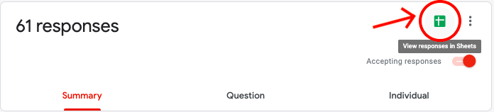
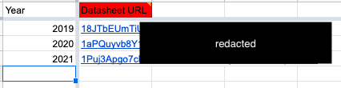

# seniormap
An interactive map of GMHS seniors' college/postsecondary destinations.  Created by Erik Boesen (GMHS Class of 2019), the map is now maintained by the GMHS Advanced Programming Club. If you'd like to make a submission, please visit [the map](https://apc-gm.com/seniormap) and click on the form in the bottom right corner. 

## Maintainence instructions 
### Creating a the form and spreadsheet for a new year

1. Navigate to the ['Senior Map' folder](https://drive.google.com/drive/folders/1Jko-Gei3H9em6nXjL_Tia8j4NNptmD6k) on Google Drive and create a new folder with the year of the graduating class (e.g. 2027). Request access to the folder if you do not already have access.  
2. Make a copy of a previous year's form and edit content accordingly for the appropriate year. 
3. Ensure the form has a linked Google spreadsheet with the appropriate fields. 

4. Publish the spreadsheet to the web (File > Publish to the web; link will then be provided). 

### Adding the new year to the code base

1. Within `js/scripts.js`, find the `var dataDocuments` and add an entry, with the spreadsheet's datasheet URL for the appropriate year.
   - For example: `['2027', 'a8a8a8a8a8a8a8a8a8a8a8a8a8a'],`
2. Within `index.html` update the linked form link to the latest year.
   - For example: `
<a href="https://forms.gle/form">Submit your destination here</a>
`
3. Create an entry for the student submission spreadsheet you created previously in the 'Year Data' sheet (Senior Map/Shared Data/Year Data). Mimick the existing entry cells and paste the datasheet URL next to the year you created. 
.

### Obtaining and readying senior portraits of students

1. Email the GMHS registrar, Lynette Kemp, for a list of students in your grade. The registrar is the administrator who manages student enrollment and will have this information on hand; their contact information is listed in the [GMHS staff directory](https://www.fccps.org/o/gmhs/staff?filter_id=%5B68455%5D).
2. Email the yearbook club teacher lead and ask for senior portraits for the senior map. They will share a folder with you on Google Drive containing all the portraits.
   - These images will be in alphabetical order with file names of 00001.jpeg, 00002.jpeg, etc. 
   
3. Download all of the photos from Google Drive into a folder on your desktop.
4. Download the photo naming script available at [`resources/tools/namePictures.py`](https://github.com/apc-gmhs/seniormap/blob/gh-pages/resources/tools/namePictures.py).
5. Convert the spreadsheet of names into a 2D array to replace `[['firstname', 'lastname']]`.
   - For example `[['Bill', 'Axel'], ['Sally', 'Breeze'], ['Manuel','Collins']]`
   - There's a number of online tools that will do this for you, such as [this site](https://www.seabreezecomputers.com/excel2array).
6. Run the Python script, renaming all of the unnamed photos to their corresponding student names. 
   - It's important to note that both the array of names and the student photos must be aligned and set up correctly to function properly. For example if a student is present in the array, but doesn't have a photo, all of the photo's names will be off by one. Setting up the script correctly is a little bit time consuming, but far faster than manually renaming each photo. 
7. Create a new folder inside of `portraits` named with the corresponding year.
8. Upload the pictures to that folder. 

### Adding a new student to the map after form submission 

1. After a student submits the form, a new entry will appear in the the corresponding spreadsheet.
2. If the student appears on the map, highlight the entry in green to indicate they're visible.
3. If the student does not appear on the map, the college they are attending must be added .
   - To do this, create a new entry in 'Shared Data' (Senior Map/Shared Data/Location Information) for both the coordinates and logos subsheets.
   - Mimicking existing cells, add the coordinates, and the logo to the entries.
   
   
   - A good way to see if certain schools don't have logos is by using the developer console. The names of institutions missing logos will appear here.  
   
4. After ensuring the student appears, mark them visible! 

### Passing the map onto future classes 
1. Find an experienced leadership member of the APC who is a student in the next graduating class who is able and willing to take over the map.
2. Request their personal email address and transfer ownership of the Senior Map Google Cloud Project to them.
3. Give their student email account ownership of all Senior Map Google Drive folders and files.
4. Make sure they can access the Senior Map GitHub repository as editor.

---

If you have any questions about the codebase/maintaining it, or adding a new class to the page, don't hesistate to reach out to past maintainers. Also make sure you publicize the map to your class to carry on the tradition! Talk to your class officers about posting the map on Schoology, reach out to your college counselor about sending the map out and consider sharing the map on social media. 
